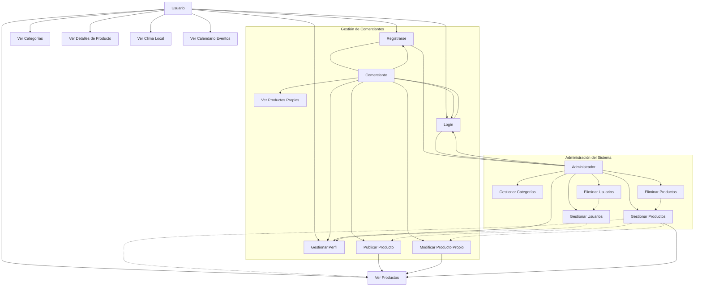

```mermaid
graph TD
    usuario[Usuario] --> registrarse[Registrarse]
    usuario --> login[Login]
    usuario --> ver_productos["Ver Productos"]
    usuario --> ver_categorias["Ver Categorías"]
    usuario --> ver_detalles["Ver Detalles de Producto"]
    usuario --> ver_clima["Ver Clima Local"]
    usuario --> ver_calendario["Ver Calendario Eventos"]
    usuario --> gestionar_perfil["Gestionar Perfil"]

    subgraph "Gestión de Comerciantes"
        comerciante[Comerciante] --> registrarse
        comerciante --> login
        comerciante --> publicar_producto["Publicar Producto"]
        comerciante --> modificar_producto["Modificar Producto Propio"]
        comerciante --> ver_productos_propios["Ver Productos Propios"]
        comerciante --> gestionar_perfil
    end

    subgraph "Administración del Sistema"
        admin[Administrador] --> login
        admin --> gestionar_productos["Gestionar Productos"]
        admin --> gestionar_usuarios["Gestionar Usuarios"]
        admin --> gestionar_categorias["Gestionar Categorías"]
        admin --> eliminar_productos["Eliminar Productos"]
        admin --> eliminar_usuarios["Eliminar Usuarios"]
        admin --> gestionar_perfil
    end

    registrarse <--- comerciante
    registrarse <--- admin
    login <--- comerciante
    login <--- admin

    gestionar_productos -.-> publicar_producto
    gestionar_productos -.-> modificar_producto
    gestionar_productos -.-> ver_productos

    gestionar_usuarios -.-> gestionar_perfil

    publicar_producto --> ver_productos
    modificar_producto --> ver_productos
    gestionar_productos --> ver_productos

    eliminar_productos -.-> gestionar_productos
    eliminar_usuarios -.-> gestionar_usuarios
```